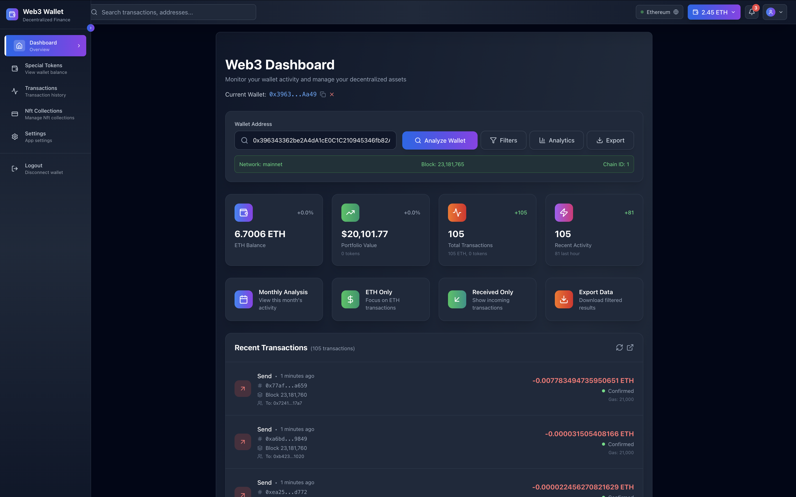
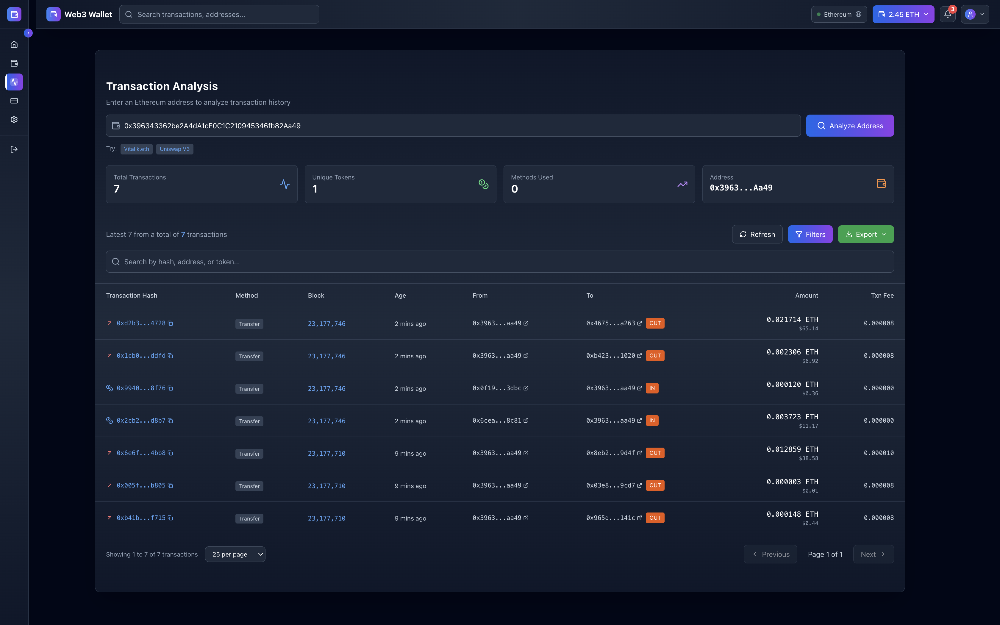
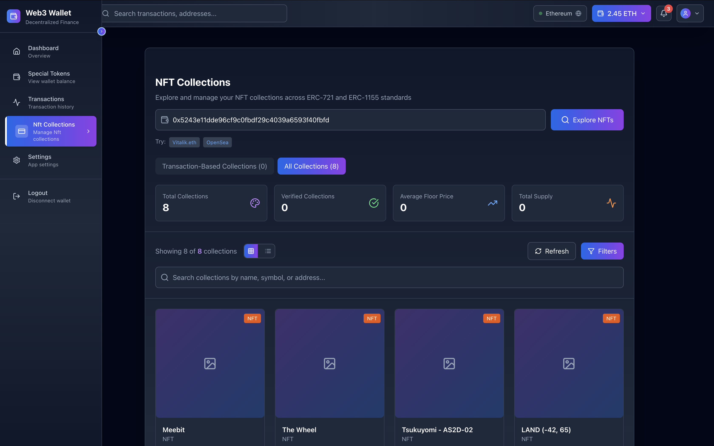

# Foundry Origintail Wallet Query

A full-stack application for querying and crawlling wallet transactions and NFTs with a React frontend and Node.js backend.

## Quick Start

### Prerequisites
- Node.js (v14 or higher)
- npm or yarn package manager

### Installation

1. **Clone the repository**
   ```bash
   git clone https://github.com/unawarexi/FullStack-Origintail-WallletQuery.git
   cd FullStack-Origintail-WallletQuery
   ```

## Frontend Setup

2. **Navigate to frontend directory and install dependencies**
   ```bash
   cd walletQuery_Frontend
   npm install
   ```

3. **Start the frontend development server**
   ```bash
   npm run dev
   ```

## Backend Setup

4. **Navigate to backend directory and install dependencies**
   ```bash
   cd walletQuery-Backend
   npm install
   ```

5. **Environment Configuration**
   - Copy `.env.example` to `.env`
   - Fill in your environment variables using the example file as reference
   ```bash
   cp .env.example .env
   ```

6. **Start the backend server**
   ```bash
   npm start
   ```

## 🔌 OpenSea SDK Configuration

If the OpenSea SDK (`.api` folder) in the backend isn't properly configured:

1. **Remove existing SDK installation**
   ```bash
   rm -rf .api
   ```

2. **Reinstall OpenSea SDK**
   ```bash
   npx api install "@opensea/v2.0#dq0ez115mcc6s59b"

   or use your own opensea sdk from their documentation after you signup
   ```
   
   **Important:** When prompted:
   - Select **JavaScript**
   - Select **CommonJS** (NOT ES6 modules)

## Usage Instructions

### Test Addresses

The project includes test addresses in `address.txt` at the root directory:

### Ether Transactions Testing
Use the **first address** from `address.txt` to test:
- Dashboard functionality
- Transaction routes
- Ether transaction queries





### NFT Testing  
Use the **second address** from `address.txt` to test:
- NFT cards route
- NFT collection display
- OpenSea integration



## Project Structure

```
Foundry-Origintail-WallletQuery/
├── walletQuery_Frontend/     # React frontend application
├── walletQuery-Backend/      # Node.js backend API
├── address.txt              # Test wallet addresses
└── README.md               # Project documentation
```

## Troubleshooting

- If you encounter OpenSea SDK issues, follow the SDK configuration steps above
- Ensure all environment variables are properly set in the `.env` file
- Check that both frontend and backend servers are running on different ports
- Verify Node.js version compatibility

## Support

If you encounter any issues during setup, please mail me chukwuweike.work@gmail.com.

---

**Happy coding!**
